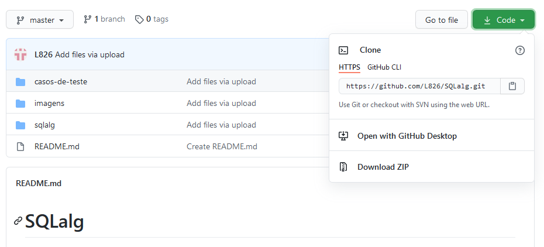
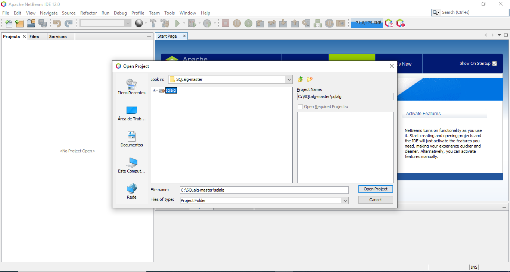
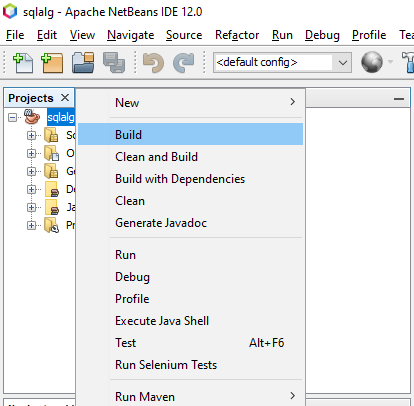

# SQLalg

## Introdução
Está começando a mexer com SQL agora e está tendo dificuldades? Então o SQLalg é perfeito para você.

SQLalg é uma linguagem criada para que o programador consiga escrever um código em SQL, mas no formato de um algoritmo. Esse repositório contém o compilador do SQLalg e vai detectar os mesmos erros que um compilador de SQL detectaria e, caso seu algoritmo não possua erros, ele vai gerar um código em .sql!

## Como usar
O compilador de SQLalg foi criado usando o gerador de gramática ANTLR4 e programado em Java usando o NetBeans. Para usar o compilador é necessário ter instalado o [NetBeans 12.0](https://netbeans.apache.org/download/nb120/nb120.html) ou um similar que possua as dependências do ANTLR4 e o [Java versão 14](https://www.oracle.com/java/technologies/javase/jdk14-archive-downloads.html) ou mais recente. Com eles instalados, basta seguir os passos a seguir:

1. Baixe o repositório SQLalg como arquivo .zip ou clone o repositório no seu computador.



2. Abra o NetBeans e abra o projeto que está dentro de \SQLalg-master. Caso tenha baixado o repositório como .zip, será necessário extrair o arquivo antes de abrir o projeto.



3. Clique em sqlalg com o botão direito e clique em Build (Construir). Assim ele vai recompilar o projeto e gerar um arquivo de nome `sqlalg-1.0-SNAPSHOT-jar-with-dependencies.jar` dentro da pasta \target.



4. Depois de criar o arquivo .jar, abra o terminal. Nele faça o seguinte comando:
```
  java -jar enderecoDoProjeto\SQLalg-master\sqlalg\target\sqlalg-1.0-SNAPSHOT-jar-with-dependencies.jar enderecoDoProjeto\SQLalg-master\casos-de-teste\entrada\teste01.txt enderecoDeSaida\saida.txt
```
`enderecoDoProjeto` representa a pasta onde está salvo o projeto. `enderecoSaida` indica onde vai ser salvo o arquivo `saida.txt` com o(s) erro(s) identificado(s). As saídas esperadas para cada caso estão em SQLalg-master\casos-de-teste\saida.


Se as etapas anteriores forem feitas corretamente, não aparecerá nenhuma mensagem no terminal e um arquivo vai ser criado no \enderecoDeSaida. Esse arquivo pode conter linhas de erro ou um código em formato SQL, se o caso de teste não possuir erros.

É possivel gerar um programa em SQL diretamente ao substituir saida.txt por saida.sql no terminal. Assim o programa escreve um código compilável em SQL.

Esse é o básico para usar o compilador. Há 20 casos de teste no repositório para demonstração, mas você pode usar o compilador como quiser, criando seus próprios testes e gerando novos códigos.

#### Trabalho feito por Roberto Akio Oizuni Yamamoto, estudante de BCC da UFSCar.
